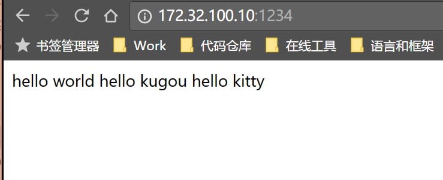
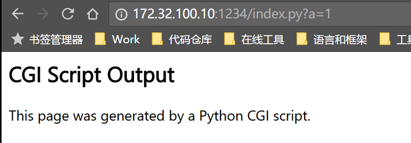
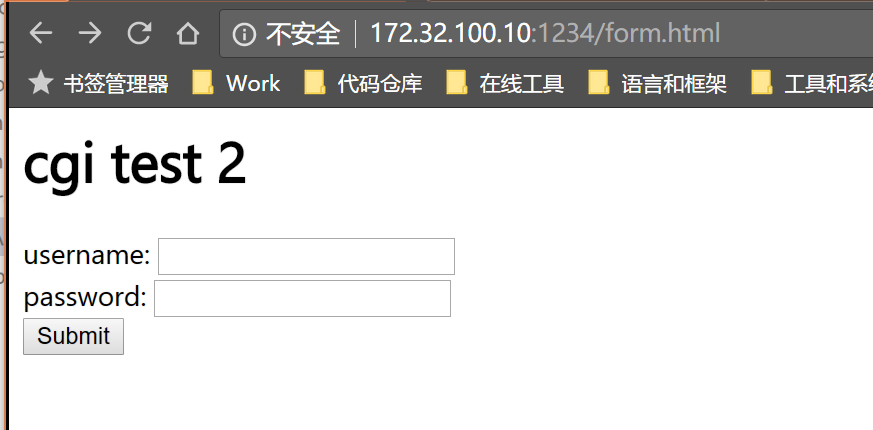
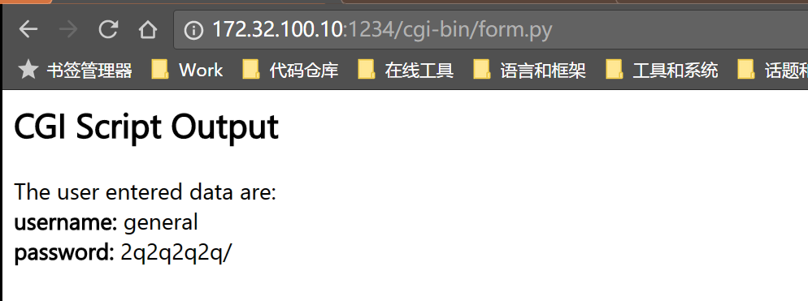

# ghttpd

C语言编写的简单http服务器

编译方法

```
$ gcc -g -lpthread ./webserver.c
```

然后直接运行`a.out`即可.

可以这样访问



由python cgi脚本生成如下响应(注意访问参数的存在)



POST方法与cgi脚本交互示例



输入用户名密码, 点击'Submit', 可以得到如果结果



------

参考

[tinyhttpd](https://github.com/AngryHacker/code-with-comments/tree/master/tinyhttpd)

[如何创建和使用Python CGI脚本](https://linux.cn/article-4377-1.html)

这段小程序默认面对GET请求直接返回它所要的文件, 而POST请求则是要执行CGI脚本. 当然, 其实实际场景中GET请求也是可以执行CGI脚本的, 比如前端传入页码参数, 服务端程序就需要查询数据库的指定页数.

服务端响应的响应体应该没有结束标志, 当连接关闭就说明响应包已经全部发完了.

关于cgi, 应该是某种协议, http服务器按照协议中的格式, 与cgi脚本交互. 这个工程中使用了python的cgi库, 可以获取前端页面传入的表单数据并显示(py文件需要有可执行权限).